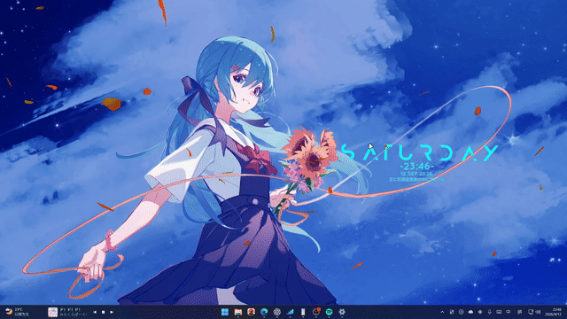
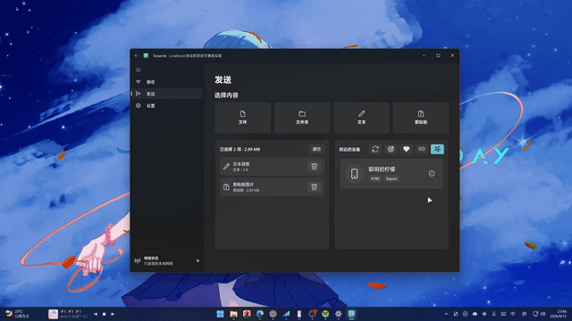
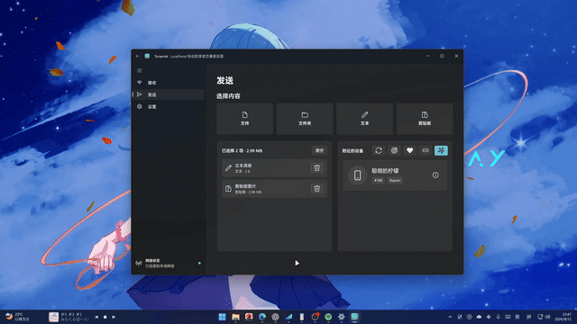
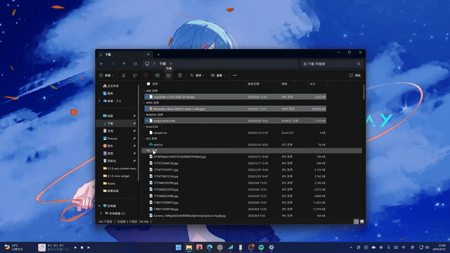

<p align="center">
  
</p>

<h1 align="center">Tonarink</h1>

<p align="center">
  面向 Windows 11 的快速、私密文件与文本传输工具。<br>
  让附近的设备自然连接，无需云端，也无需互联网。
</p>

<p align="center">
  <a href="README.md">简体中文</a> ·
  <a href="README.en.md">English</a>
</p>

<p align="center">
  <a href="https://kusutori.github.io/Tonarink/">官方网站</a> ·
  <a href="https://github.com/kusutori/Tonarink/releases/latest">下载</a> ·
  <a href="https://github.com/kusutori/Tonarink/issues">问题反馈</a>
</p>

<p align="center">
  <a href="https://apps.microsoft.com/detail/9P29ZJGFWPJR"></a>
  <a href="https://github.com/kusutori/Tonarink/releases/latest"></a>
  <a href="LICENSE"></a>
  
</p>

> [!IMPORTANT]
> Tonarink 是 [LocalSend](https://localsend.org/) 协议的独立、非官方实现，
> 可以与兼容 LocalSend 的设备互相传输，但不隶属于 LocalSend 官方项目，
> 也未获得其背书或发行。

## 功能演示

| **动态启动画面** | **设备卡片连通动画** |
| :---: | :---: |
|  |  |
| **查看与选择接收文件** | **Windows 系统分享集成** |
|  |  |

[观看 Tonarink 1.0.5 完整演示视频](https://github.com/kusutori/Tonarink/releases/download/app-v1.0.5/Tonarink-1.0.5-demo.mp4)。

## 功能亮点

- 自动发现局域网中兼容 LocalSend 的设备。
- 发送和接收文件、文件夹、剪贴板内容以及可直接预览的文本。
- 展开接收请求，重命名文件、更改保存目录，或只接收选中的项目。
- 通过图案或文本验证设备，使用 PIN 保护传输，并在局域网中启用 HTTPS。
- 支持自动发现、手动地址、收藏夹以及浏览器链接等多种分享方式。
- 集成 Windows 分享菜单、文件资源管理器右键菜单、系统通知、任务栏进度和系统托盘。
- 支持 Windows 11 材质、浅色与深色主题，以及运行时语言切换。
- 提供 x64 和 ARM64 的签名 MSIX 安装包与 Native AOT 便携版。

## 下载

日常使用推荐直接[从 Microsoft Store 安装](https://apps.microsoft.com/detail/9P29ZJGFWPJR)，
可以自动获取适合当前设备架构的版本及后续更新。商店版本采用自包含 Native AOT，
无需单独安装 .NET Desktop Runtime。

也可以从 [GitHub Releases](https://github.com/kusutori/Tonarink/releases/latest)
下载独立发行包。建议选择 MSIX，因为 Windows 分享菜单和文件资源管理器右键菜单等
功能依赖打包应用身份。

| 版本 | 推荐场景 |
| --- | --- |
| Native AOT MSIX | 推荐优先尝试，启动更快且通常占用更低。 |
| 普通 MSIX | 如果 Native AOT 版本在当前设备上不够流畅，请使用此稳定版本。 |
| Portable | 无需安装即可运行，但无法使用依赖打包身份的 Windows 集成功能。 |
| Widgets | 仅供实验和测试，小组件功能仍在开发中。 |

大多数电脑请选择 `x64`，Windows on Arm 设备请选择 `ARM64`。解压下载的
MSIX ZIP 后运行 `Install.ps1`，详细步骤请参阅[安装指南](docs/development-msix-install.md)。

## LocalSendDotNet.Core

Tonarink 基于 [LocalSendDotNet.Core](src/LocalSendDotNet.Core/README.md) 构建。
它是与 UI 无关的 LocalSend v2.2 协议 .NET 11 实现，由本仓库维护，
同时也作为独立 NuGet 包发布。

核心库继续使用 `LocalSendDotNet.Core` 包名和公开 API，其他 .NET 应用可以独立引用。
使用指南、兼容性说明、互操作矩阵和发布文档位于
[`src/LocalSendDotNet.Core`](src/LocalSendDotNet.Core)。

## 从源代码构建

正式 Windows 客户端使用 .NET 11、Windows App SDK 和 Microsoft UI Reactor 构建。

```powershell
dotnet restore Tonarink.slnx
dotnet build Tonarink.slnx
dotnet test Tonarink.slnx
```

Windows 客户端位于 `src/Tonarink.App`。仓库中仍保留实验性的 Blazor Web 和
Hybrid 项目，但它们暂未包含在当前正式版本中。打包与发布流程参阅
[docs/packaging.md](docs/packaging.md) 和
[docs/app-release-ci.md](docs/app-release-ci.md)。

## 参与贡献与本地化

欢迎提交错误报告、功能建议、代码和翻译。产品反馈可以前往
[Issues](https://github.com/kusutori/Tonarink/issues)。英文源语言资源和社区翻译
通过 Crowdin 与 CI 自动同步。

参与贡献前，请阅读[安全政策](SECURITY.md)、[隐私政策](PRIVACY.md)和
[第三方许可证与鸣谢](NOTICE)。

## 与 LocalSend 的关系

LocalSend 建立了开放协议和生态，使不同客户端之间的互操作成为可能。
我们感谢 LocalSend 项目及其贡献者所做的工作。协议兼容不代表官方身份或背书，
具体署名与说明请参阅 [NOTICE](NOTICE)。

## 许可证

Tonarink 与 LocalSendDotNet.Core 均使用
[Apache License 2.0](LICENSE) 发布。
